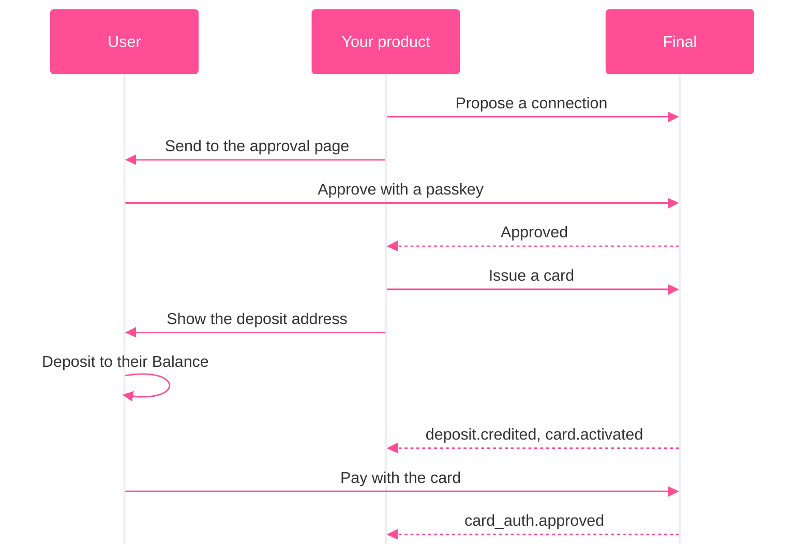

Final lets you give your users compliant, agent-ready wallets, cards, and other financial tools in minutes without
the burden of building and maintaining a financial stack. You can focus on your product, while Final handles the complexity of money.

## How it works

## Five terms

| | |
| --- | --- |
| **Balance** | A wallet that holds one asset. A user can have many Balances, and a Balance can contain sub-balances. |
| **Connection** | Your access to a user's Balances once they approve. |
| **Card** | Lets the user spend a Balance anywhere cards work. |
| **Event** | A record of something that happened, like a deposit or a card payment. |
| **Test mode** | The same API with fake money. Use a test key. |

## What you'll need

- A [Final.com](https://final.com) account
- [Setup](https://final.com/temporary/integrator-setup) your integrator and get your API keys
- A device with passkeys

## Get integrated quickly

<CardGroup cols={2}>
  <Card title="App" icon="device-mobile" href="/get-started/quickstart-app">
    Serverless iOS or Android app integration.
  </Card>
  <Card title="Server" icon="server" href="/get-started/quickstart-server">
    Your backend calls Final with a secret key.
  </Card>
</CardGroup>

Both end with a connected test user, a funded Balance, an active card and a purchase.

